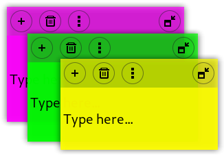

# Sticky Reborn notes extension

This is a fork of [Sticky Notes](https://github.com/maoschanz/notes-extension-gnome), a really nice GNOME Shell extension by Romain F. T. that provides customizable sticky notes.

It was forked only to add rudimentary support to Gnome 40+, because we need it and it wasn't ready yet.

I don't plan on maintaining it further, so if the original author updates his extension, this one will be deleted.

### Compatible versions

Version 22_1 has been released the 13/01/2022

| GNOME Shell version | Extension version 22_2
|---------------------|-----------------------|
| **41**              | Yes                   |
| **40**              | Yes                   |

Older version support is dropped

### Available languages

| code  | Language name |
|-------|---------------|
|       | English       |
| es    | Castillan     |
| fr    | French        |
| hr    | Croatian      |
| nl    | Dutch         |
| pt_BR | Brazilian Portuguese |
| tr    | Turkish       |
| zh_TW | Chinese (traditional) |

----

## Installation

To manually install this version, download the files, run `./install.sh`, restart
the session, and enable the extension.

Another option is to download the release zip and use the command:

    gnome-extensions install filename.zip

----

## Storage

Data is stored in your disk: files are still in `~/.local/share/maestroschan.fr` and will autoload 
your old files without problems.

